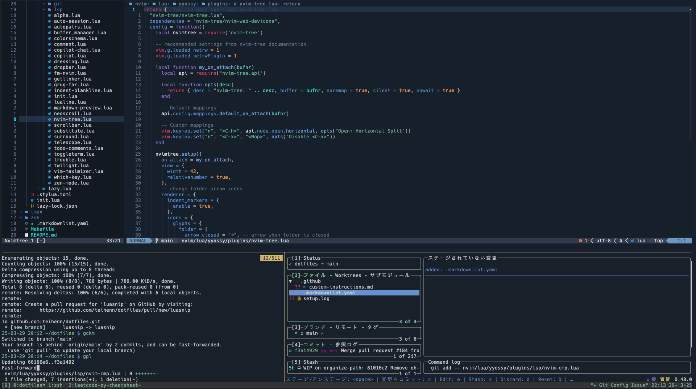
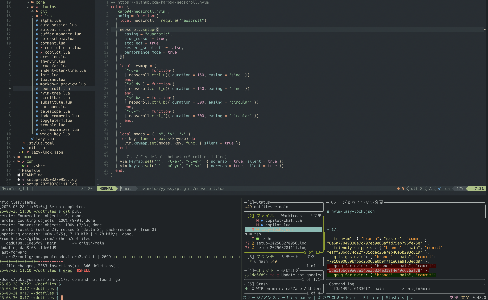

# dotfiles

A collection of my personal dotfiles and configuration settings for development tools, designed for easy setup and consistent experience across different systems.

## NeoVim/iTerm2 Screenshot

- 2025-03-29
- Nightfox theme



## How to setup `dotfiles` on a new system

### Prerequisites

- macOS
- Homebrew is installed
- [`aqua`](https://aquaproj.github.io/) (installed via Homebrew)
- Your `.zshrc` will be installed and configured to point to your global `aqua.yaml` (e.g., via `AQUA_GLOBAL_CONFIG`)

> 🛠️ Note: `aqua` and your `.zshrc` can be set up automatically by this setup process.

### Usage

#### Clone the repository to your home directory

```bash
cd
git clone git@github.com:teihenn/dotfiles.git
cd dotfiles
```

#### Run setup

##### Full setup

```bash
make
```

##### Partial setup

e.g., Setup `.zshrc` only

```bash
make zsh
```

#### Show avaliable make commands

```bash
make help
```

### ⚠️ Settings Note

#### iTerm2

To use the iTerm2 config managed in this repository, make sure the following setting is enabled in iTerm2:

1. Open **iTerm2 → Preferences → General → Settings**
2. Enable: ✅ **Load settings from a custom folder or URL**
3. Set the folder path to: ~/Documents/ConfigFiles/iTerm2

## How to add `dotfiles` to this repository

You can add new dotfiles to this repository by following these steps:

1. Copy or move the config file into the appropriate directory
   For example, to add your `~/.gitconfig`:

```bash
mkdir -p ~/dotfiles/git
cp ~/.gitconfig ~/dotfiles/git/.gitconfig
```

2. Update `setup.sh` to create a symbolic link

Edit `setup.sh` and add a new `install_gitconfig()` function if it doesn't already exist:

```bash
install_gitconfig() {
    log "Setting up gitconfig..."
    backup_and_link "$HOME/.gitconfig" "$DOTFILES_DIR/git/.gitconfig"
}
```

Also, update the `main()` function to support this target:

```bash
gitconfig) install_gitconfig ;;
```

3. Add a Makefile target

```bash
gitconfig: ## Install .gitconfig
 ./setup.sh gitconfig
```

4. Test it

```bash
make gitconfig
```

Check that the symlink is created and the config works as expected.

## Configs in this repo but not installed by the setup script

The following configuration files are included in this repository
but are not managed by the setup script,
as they are not the kind that can simply be placed
somewhere on the local machine to be automatically loaded.

- bettertouchtool

## Tools that are not managed by dotfiles

### Raycast

Raycast pro plan can manage the settings via cloud sync.

## Reference

- https://github.com/neovim/nvim-lspconfig/blob/master/doc/configs.md#ruff

## Past NeoVim/iTerm2 Screenshots

### 2025-03-28

- everforest theme


